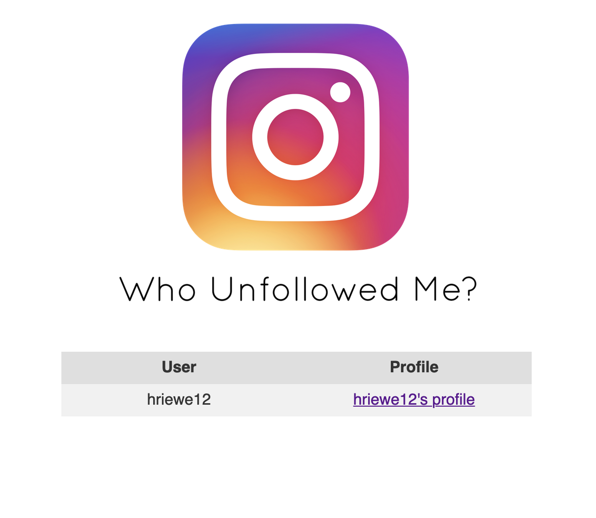

# Who Unfollowed Me?

My first Flask web app for programmatically determining users who unfollow your Instagram account.

Thanks to LevPasha for providing an unofficial Instagram API wrapper for Python. (https://github.com/LevPasha/Instagram-API-python)

## How To Use

` pip install -r requirements.txt `

In `WhoUnfollowedMe.py` edit line 33 to include your Instagram username and password.

Run the program with `python3 WhoUnfollowedMe.py`

A flask server will start and you will need to navigate to http://127.0.0.1:5000/

On your first run it will display that no one has unfollowed you. This is because the program relies on data collected at run time. Run the program again at a later date to see everyone that has unfollowed you since the previous run.

## Known Issues

Currently the link next to the user in the table just takes you to instagram.com (I am working on dynamic links in the html to direct you to the individual users profile)

If a large number of users have unfollowed you the table has the potential to extend past the limit of the html page. A fix is in progress for dynamic page sizing.

## Contributing 

If you have an idea to make the program better or to fix any bugs you find open a pull request and I will take a look at it.
